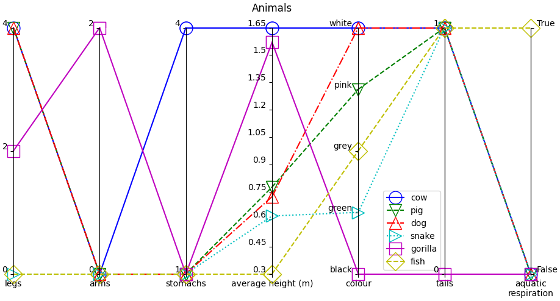

# parallel_coordinate_plot

A Python package for producing parallel coordinate plots.

The following example was generated using ```examples/demo.py```.



## Rationale

Parallel coordinate plots are sometimes preferred over traditional radar (or spider) plots. In radar plots, its internal area is typically viewed as a visual metric to qualify the performance, but the shape and area are highly dependent on the order of data dimensions around the circle.

Parallel coordinate plots avoid this issue, and only visualize the relevant information --- groupings in each dimension.


# Information

### License

This project is licensed under the **Apache License 2.0** - see the [LICENSE](LICENSE) file for details.

### Contributing

Open-source contributions are welcome. Please report an issue or submit a pull request.

### Citation

If you use ```parallel_coordinate_plot``` in your work, please cite it as below:

```BibTex
@software{parallel_coordinate_plot,
    author = {Cain, Nolan},
    license = {Apache-2.0},
    title = {{parallel\_coordinate\_plot}},
    url = {https://github.com/nolan-sldprt/parallel_coordinate_plot/},
    version = {0.1.0},
}
```